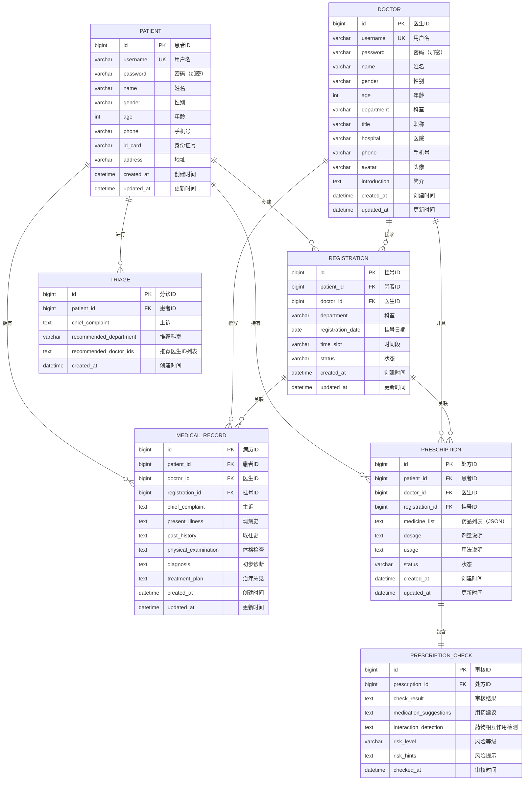

# 智慧云脑诊疗平台 - 数据库设计文档

## 一、ER 图

## 二、表结构说明

### 2.1 patient（患者表）

| 字段 | 类型 | 约束 | 说明 |
|------|------|------|------|
| id | BIGINT | PRIMARY KEY, AUTO_INCREMENT | 患者ID |
| username | VARCHAR(50) | NOT NULL, UNIQUE | 用户名（登录用） |
| password | VARCHAR(255) | NOT NULL | 密码（BCrypt加密） |
| name | VARCHAR(50) | NOT NULL | 真实姓名 |
| gender | VARCHAR(10) | | 性别 |
| age | INT | | 年龄 |
| phone | VARCHAR(20) | | 手机号 |
| id_card | VARCHAR(18) | | 身份证号 |
| address | VARCHAR(255) | | 地址 |
| created_at | DATETIME | DEFAULT CURRENT_TIMESTAMP | 创建时间 |
| updated_at | DATETIME | ON UPDATE CURRENT_TIMESTAMP | 更新时间 |

### 2.2 doctor（医生表）

| 字段 | 类型 | 约束 | 说明 |
|------|------|------|------|
| id | BIGINT | PRIMARY KEY, AUTO_INCREMENT | 医生ID |
| username | VARCHAR(50) | NOT NULL, UNIQUE | 用户名（登录用） |
| password | VARCHAR(255) | NOT NULL | 密码（BCrypt加密） |
| name | VARCHAR(50) | NOT NULL | 真实姓名 |
| gender | VARCHAR(10) | | 性别 |
| age | INT | | 年龄 |
| department | VARCHAR(50) | NOT NULL | 科室 |
| title | VARCHAR(50) | | 职称 |
| hospital | VARCHAR(100) | | 医院 |
| phone | VARCHAR(20) | | 手机号 |
| avatar | VARCHAR(255) | | 头像URL |
| introduction | TEXT | | 简介 |
| created_at | DATETIME | DEFAULT CURRENT_TIMESTAMP | 创建时间 |
| updated_at | DATETIME | ON UPDATE CURRENT_TIMESTAMP | 更新时间 |

### 2.3 registration（挂号记录表）

| 字段 | 类型 | 约束 | 说明 |
|------|------|------|------|
| id | BIGINT | PRIMARY KEY, AUTO_INCREMENT | 挂号ID |
| patient_id | BIGINT | NOT NULL, FOREIGN KEY | 患者ID |
| doctor_id | BIGINT | NOT NULL, FOREIGN KEY | 医生ID |
| department | VARCHAR(50) | NOT NULL | 科室 |
| registration_date | DATE | NOT NULL | 挂号日期 |
| time_slot | VARCHAR(20) | NOT NULL | 时间段（如 09:00-10:00） |
| status | VARCHAR(20) | DEFAULT 'pending' | 状态：pending/completed/cancelled |
| created_at | DATETIME | DEFAULT CURRENT_TIMESTAMP | 创建时间 |
| updated_at | DATETIME | ON UPDATE CURRENT_TIMESTAMP | 更新时间 |

### 2.4 triage（分诊记录表）

| 字段 | 类型 | 约束 | 说明 |
|------|------|------|------|
| id | BIGINT | PRIMARY KEY, AUTO_INCREMENT | 分诊ID |
| patient_id | BIGINT | NOT NULL, FOREIGN KEY | 患者ID |
| chief_complaint | TEXT | NOT NULL | 患者主诉（症状描述） |
| recommended_department | VARCHAR(50) | | AI推荐科室 |
| recommended_doctor_ids | TEXT | | AI推荐医生ID列表（逗号分隔） |
| created_at | DATETIME | DEFAULT CURRENT_TIMESTAMP | 创建时间 |

### 2.5 medical_record（病历表）

| 字段 | 类型 | 约束 | 说明 |
|------|------|------|------|
| id | BIGINT | PRIMARY KEY, AUTO_INCREMENT | 病历ID |
| patient_id | BIGINT | NOT NULL, FOREIGN KEY | 患者ID |
| doctor_id | BIGINT | NOT NULL, FOREIGN KEY | 医生ID |
| registration_id | BIGINT | FOREIGN KEY | 关联挂号ID |
| chief_complaint | TEXT | | 主诉 |
| present_illness | TEXT | | 现病史 |
| past_history | TEXT | | 既往史 |
| physical_examination | TEXT | | 体格检查 |
| diagnosis | TEXT | | 初步诊断 |
| treatment_plan | TEXT | | 治疗意见 |
| created_at | DATETIME | DEFAULT CURRENT_TIMESTAMP | 创建时间 |
| updated_at | DATETIME | ON UPDATE CURRENT_TIMESTAMP | 更新时间 |

### 2.6 prescription（处方表）

| 字段 | 类型 | 约束 | 说明 |
|------|------|------|------|
| id | BIGINT | PRIMARY KEY, AUTO_INCREMENT | 处方ID |
| patient_id | BIGINT | NOT NULL, FOREIGN KEY | 患者ID |
| doctor_id | BIGINT | NOT NULL, FOREIGN KEY | 医生ID |
| registration_id | BIGINT | FOREIGN KEY | 关联挂号ID |
| medicine_list | TEXT | NOT NULL | 药品列表（JSON数组格式） |
| dosage | TEXT | | 剂量说明 |
| usage | TEXT | | 用法说明 |
| status | VARCHAR(20) | DEFAULT 'draft' | 状态：draft/submitted/checked |
| created_at | DATETIME | DEFAULT CURRENT_TIMESTAMP | 创建时间 |
| updated_at | DATETIME | ON UPDATE CURRENT_TIMESTAMP | 更新时间 |

### 2.7 prescription_check（处方审核表）

| 字段 | 类型 | 约束 | 说明 |
|------|------|------|------|
| id | BIGINT | PRIMARY KEY, AUTO_INCREMENT | 审核ID |
| prescription_id | BIGINT | NOT NULL, FOREIGN KEY | 处方ID |
| check_result | TEXT | | AI审核结果 |
| medication_suggestions | TEXT | | 用药建议 |
| interaction_detection | TEXT | | 药物相互作用检测结果 |
| risk_level | VARCHAR(20) | DEFAULT 'low' | 风险等级：low/medium/high |
| risk_hints | TEXT | | 风险提示 |
| checked_at | DATETIME | DEFAULT CURRENT_TIMESTAMP | 审核时间 |

## 三、实体关系说明

| 关系 | 说明 | 基数 |
|------|------|------|
| 患者 → 挂号 | 一个患者可创建多条挂号记录 | 1:N |
| 患者 → 分诊 | 一个患者可进行多次分诊 | 1:N |
| 患者 → 病历 | 一个患者拥有多份病历 | 1:N |
| 患者 → 处方 | 一个患者持有多张处方 | 1:N |
| 医生 → 挂号 | 一个医生接诊多个挂号 | 1:N |
| 医生 → 病历 | 一个医生撰写多份病历 | 1:N |
| 医生 → 处方 | 一个医生开具多张处方 | 1:N |
| 挂号 → 病历 | 一次挂号对应一份病历 | 1:1 |
| 挂号 → 处方 | 一次挂号可对应多张处方 | 1:N |
| 处方 → 审核 | 一张处方对应一次审核 | 1:1 |

## 四、建表脚本

建表脚本位于：`backend/src/main/resources/schema.sql`
